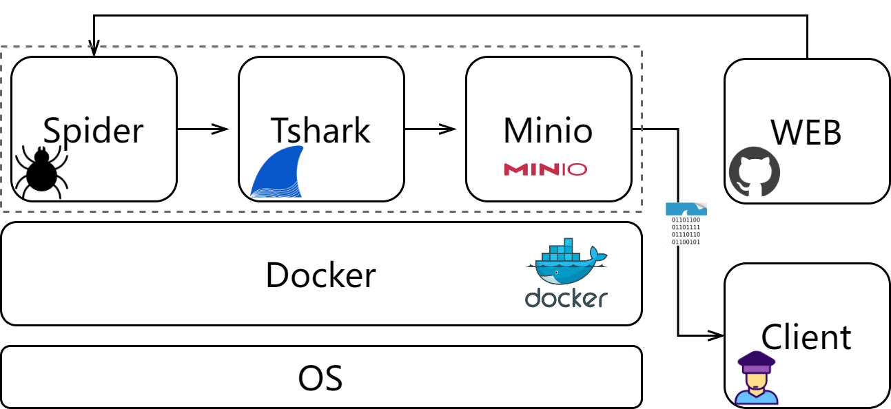

# TrafficCollection
Collect traffic from GitHub



### Config
Modify system configuration files, such as project folder paths.

`config/config.ini`
```ini
[spider]
interface=eth0
page_timeout=120000
output_dir=/traffic/datas
```
`Dockerfile`
```dockerfile
WORKDIR /traffic
...
COPY . /traffic
```
`docker-compose.yml`
```yaml
version: "3.8"

services:
  traffic:
    container_name: traffic
    volumes:
      - /traffic/datas:/traffic/datas
```


### Deploy
> The program is divided into two modes. 
> - Standalone mode is designed to collect traffic data locally and store files locally. 
> - CS mode is designed for remote servers to collect traffic, and files are automatically transferred to local clients after being cached by Minio.

#### Standalone Mode
Clone repository to `/traffic` directory.
```shell
git clone https://github.com/kid1999/TrafficCollection.git
```

Remove the last `CMD ["python", "single.py"]` annotation from `Dockerfile` and run it directly.
```shell
docker build -t traffic .
```

```shell
docker run -d -p 8000:8000 \
    -v /traffic:/traffic \
    --name my_traffic \
    traffic
```
Finally, all pcap files and logs will be output to `/traffic/datas/`

#### CS Mode
##### Server:

Clone repository to `/traffic` directory.
```shell
git clone https://github.com/kid1999/TrafficCollection.git
```

deploy with docker-compose.
```shell
docker-compose build
```
run
```shell
docker-compose up
```

##### Client:
Execute file receiving program, automatically download pcap file.

```shell
python client.py
```

Finally, all pcap files and logs will be output to `output_dir`


#### Spider Mode
Just visit the websites and create the traffic, not store files. You can use the tools, such as Wireshark, to analyze the captured traffic.

```shell
python just_spider.py
```

#### Traffic Mode
Just random collect traffic, not store files.
```shell
python random_spider.py
```


### Data Migration
```shell
tar -cJvf traffic.tar.xz /traffic/datas
```
Pack and compress, download form remote server.

`docker container prune`
`ulimit -n 65536`
`ulimit -n`


## Question (TODO)
1. Spider just wait DOM success load but all resource?